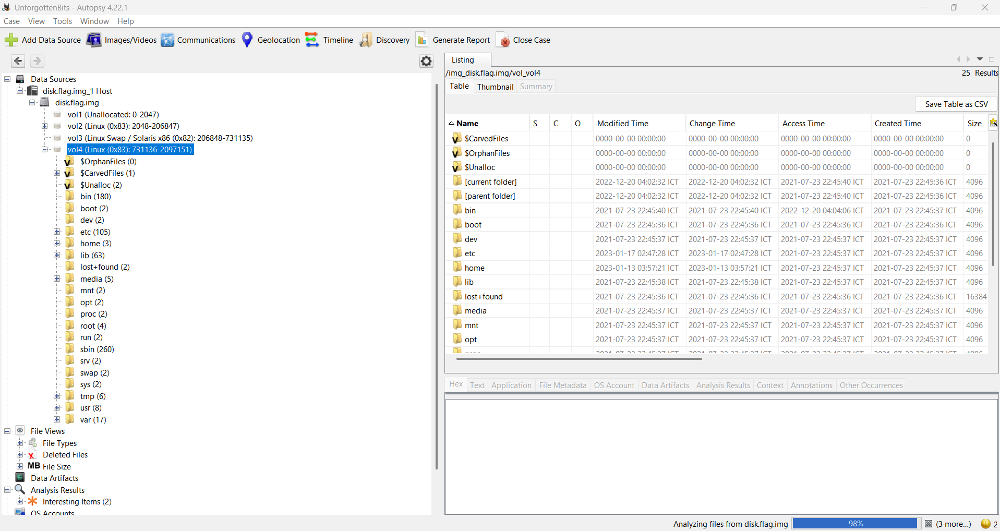
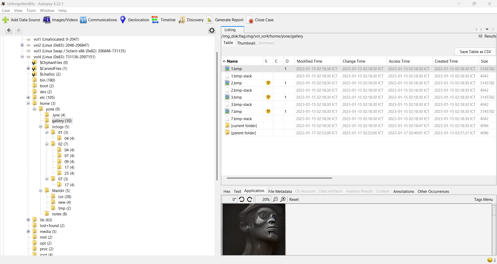
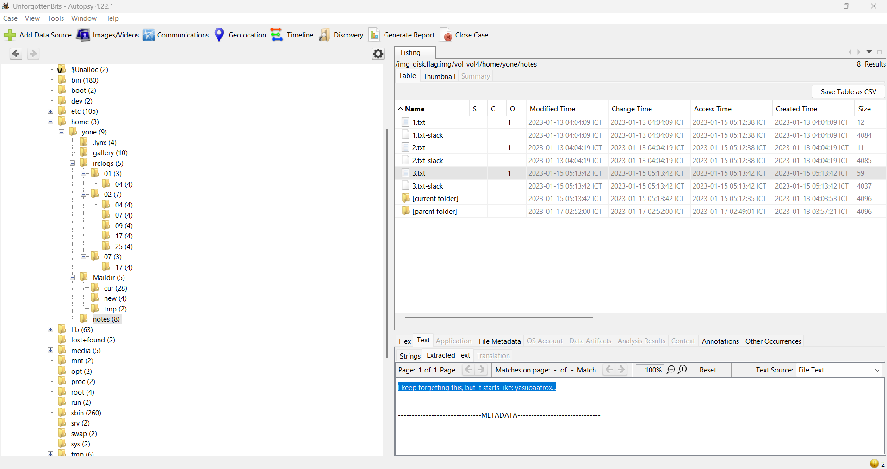
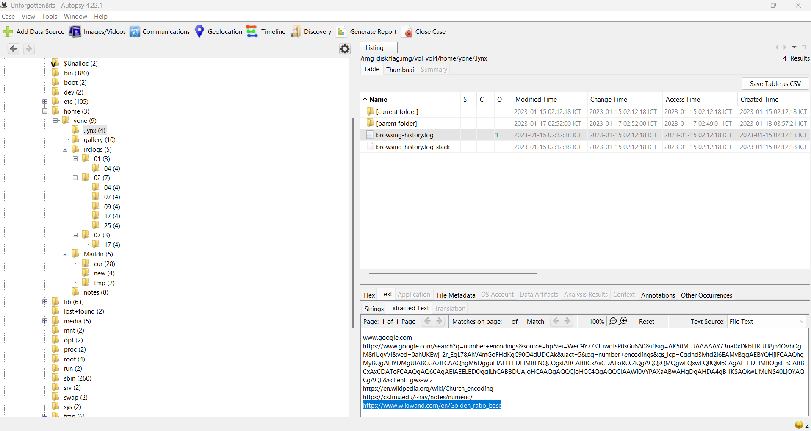
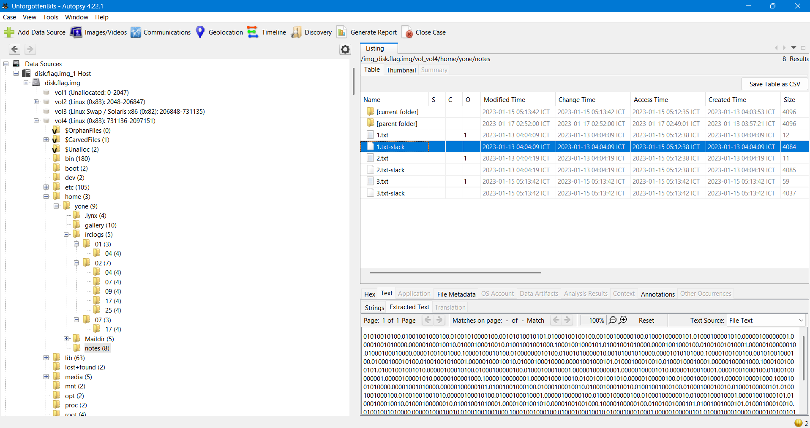

# Write up 
---

Đề bài cho file đĩa có 4 vùng, xem qua thì vùng 4 là vùng filesystem có thể khai thác




Kiểm tra thư mục home của người dùng `yone` thấy các thư mục quan đáng nghi:
```
yone/
├── .ash_history
├── gallery/        (1.bmp, 2.bmp, 3.bmp, 7.bmp)
├── irclogs/        (log chat IRC nhiều ngày)
├── .lynx/browsing-history.log
├── Maildir/cur, new, tmp   (email)
└── notes/1.txt, 2.txt, 3.txt
```



Vào thư mục `irclogs` thì phát hiện đoạn chat có thông tin của một thuật toán mã hóa:

```
Use password: akalibardzyratrundle
Use openssl, AES, cbc
salt=0f3fa17eeacd53a9
key=58593a7522257f2a95cce9a68886ff78546784ad7db4473dbd91aecd9eefd508
iv=7a12fd4dc1898efcd997a1b9496e7591
```

Có vẻ 1 file nào đó đang được mã hóa, tôi trích xuất file ảnh ra để kiểm tra xem có gì.
Dùng `steghide` để trích xuất và giải nén với pass `akalibardzyratrundle` thì chỉ được 3 file còn file 7.bmp là sai pass:

```
wrote extracted data to "les-mis.txt.enc".
wrote extracted data to "dracula.txt.enc".
wrote extracted data to "frankenstein.txt.enc".
steghide: could not extract any data with that passphrase!

```

Sau khi trích xuất được file tôi dùng openssl để giải mã 3 file này cùng với các thông tin đã được biết trước đó:

```
openssl enc -d -aes256 -in les-mis.txt.enc -out les-mis.txt \
  -S 0f3fa17eeacd53a9 \
  -K 58593a7522257f2a95cce9a68886ff78546784ad7db4473dbd91aecd9eefd508 \
  -iv 7a12fd4dc1898efcd997a1b9496e7591
  ...
```

Giải mã xong và xem thì chả thấy có thông tin gì hay flag ở đâu, nhưng còn file `7.bmp` chưa giải mã được có vẻ file này có gì đó.
Check qua thư mục `notes` thì có 3 file .txt xem thì chả thấy gì mấy đến khi xem file `3.txt` thì thấy bảo: `I keep forgetting this, but it starts like: yasuoaatrox...`, có vẻ đây là 1 hint gì đó mà nó bắt đầu từ `yasuoaatrox`, đây là gợi ý pass chăng.



Xem tổng quan thì có vẻ như user có liên quan đến `Liên Minh Huyền Thoại`, tìm thấy vài đoạn chat trong game, tên user, pass cũ đều là các tên của các tướng Liên Minh, kết hợp các thứ này với hint thì pass cần tìm là tên các tướng Liên Minh ghép lại như pass cũ.
Tạo hết các pass các bắt đầu bằng: `yasuoaatrox`, thử từng pass và tìm được pass: `yasuoaatroxashecassiopeia`

```
steghide extract -sf 7.bmp -p yasuoaatroxashecassiopeia
wrote extracted data to "ledger.1.txt.enc".
```

Thử giải mã bằng key/IV cũ nhưng bị sai

```
└─$ openssl enc -d -aes256 -in ledger.1.txt.enc -out ledger.1.txt \
  -S 0f3fa17eeacd53a9 \
  -K 58593a7522257f2a95cce9a68886ff78546784ad7db4473dbd91aecd9eefd508 \
  -iv 7a12fd4dc1898efcd997a1b9496e7591
bad decrypt
40B7097E757F0000:error:1C800064:Provider routines:ossl_cipher_unpadblock:bad decrypt:../providers/implementations/ciphers/ciphercommon_block.c:107:

```

Tìm tiếp thì phát hiện logs duyệt web quan trọng mà user đã truy cập cuối cùng là trang `https://www.wikiwand.com/en/Golden_ratio_base`.
Golden ratio base (cơ số vàng, còn gọi là base-φ hay phinary) là một hệ đếm phi chuẩn, dùng số vô tỉ φ (phi) ≈ 1.618... — tỷ lệ vàng — làm cơ số, thay vì dùng cơ số nguyên như hệ nhị phân (cơ số 2) hay thập phân (cơ số 10).



**Cách hoạt động** 

Trong hệ đếm thông thường (nhị phân), một số được biểu diễn bằng tổng các lũy thừa của 2:
```text
1011 (nhị phân) = 1×2³ + 0×2² + 1×2¹ + 1×2⁰ = 11 (thập phân)
```
Trong base-φ, cũng dùng ký hiệu chỉ gồm 0 và 1, nhưng mỗi vị trí là một lũy thừa của φ thay vì của 2:
```
số (phinary) = ... + d₂×φ² + d₁×φ¹ + d₀×φ⁰ . d₋₁×φ⁻¹ + d₋₂×φ⁻² + ...
```
với dᵢ ∈ {0, 1}.

**Điểm đặc biệt**: vì φ là số vô tỉ và có tính chất φ² = φ + 1, nên hầu hết mọi số nguyên đều có nhiều cách biểu diễn khác nhau trong hệ này (không duy nhất như nhị phân), trừ khi áp thêm quy tắc chuẩn hóa (không có hai số 1 liền kề — liên quan đến định lý Zeckendorf và dãy Fibonacci, vì φ gắn chặt với dãy Fibonacci).

Dữ liệu giấu trong slack space (1.txt) được mã hóa thành chuỗi ký tự dạng:
```
01010010100.01001001000100...
```


Chuỗi này trông giống nhị phân (chỉ có 0 và 1) nhưng có dấu chấm phân tách phần nguyên/phần lẻ ở vị trí lạ — đây chính là dấu hiệu nó không phải nhị phân chuẩn. Manh mối để nhận ra điều này nằm trong .lynx/browsing-history.log: URL cuối cùng "yone" truy cập là trang giải thích Golden ratio base, gợi ý rằng dữ liệu bí ẩn này được mã hóa bằng chính hệ đếm đó.

Viết script Python dùng scipy.constants.golden để chuyển từng đoạn 15 ký tự "phinary" sang số thập phân, rồi map sang mã ASCII:
```python
from math import ceil
from scipy.constants import golden

def phinary_to_decimal(phigit):
    integer, fraction = phigit.split(".")
    integer = integer[::-1]
    number = 0
    for i, x in enumerate(integer):
        if x == "1":
            number += golden ** i
    for i, x in enumerate(fraction):
        if x == "1":
            number += golden ** -(i + 1)
    return number

if __name__ == "__main__":
    with open("phi_enc.txt", encoding="utf-8-sig") as f:
        string = f.read().strip()

    phigits = [string[i:i + 15] for i in range(0, len(string), 15)]
    decoded_phi = [ceil(phinary_to_decimal(p)) for p in phigits if "." in p]
    print(''.join(map(chr, decoded_phi)))
```

Giải mã ra được giải mã ra bộ salt/key/iv mới:

```
salt=2350e88cbeaf16c9
key=a9f86b874bd927057a05408d274ee3a88a83ad972217b81fdc2bb8e8ca8736da
iv=908458e48fc8db1c5a46f18f0feb119f
```

Dùng nó để giải và ra đc flag: `picoCTF{f473_53413d_40405b89}`
